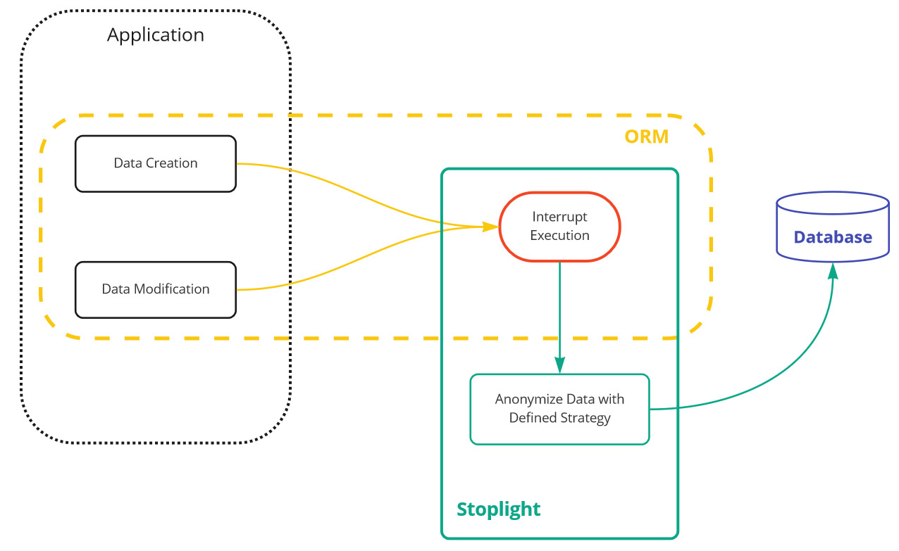

# Data Anonymization

## What is data anonymization?

Data anonymization is the process of removing personally identifiable information from datasets to ensure the anonymity of the people described in those datasets. It is usually used when transferring data between organizations or owners so that the data can be analyzed and evaluated without unintentionally compromising people's privacy. Data anonymization is useful in many contexts, like medical data, social network data, or other data that might be sensitive, and has become especially important with the emergence of Big Data and massive wide-scale breaches of individuals' privacy. This is especially troubling given how extensively personal data is traded for commercial purposes (for example, consider Cambridge Analytica, whose foundational dataset for clandestine U.S. voter targeting efforts -- which significantly swayed the results of the 2016 presidential election -- was licensed from well-known data brokers).

Data anonymization is not a perfect strategy. For one, data anonymization reduces the utility of data. Secondly, whenever data is anonymized, there is always a risk that it can be de-anonymized, especially if the anonymized dataset is compared and cross-referenced with other data. This is an especially prevalent risk nowadays given the quantity of data that is collected; there are so many public datasets to cross-reference that it is likely, through clever procedures, that someone could de-anonymize. For example, a researcher demonstrated this by taking an "anonymized" dataset of Netflix movie rentals and correlating this data with public IMDB reviews, allowing him to identify the individuals and get access to their complete rental histories. Other researchers at the Imperial College London and Belgium's Universite Catholique de Louvain were able to correctly re-identify 99.98% of individuals in anonymized data sets with just 15 demographic attributes.

Despite this, data anonymization is still _important_. Good data anonymization requires mixing multiple strategies and carefully considering the potential harms that might result from the data being de-anonymized and mitigating these harms by limiting the amount of data made available. We should consider _who_ should actually have access to complex data about people and set strict access controls.

## Strategies

There are five broad categories of anonymization operations:

- generalization, which replaces specific values with more generic ones.
- suppression, which removes specific values from datasets.
- anatomization, which disassociates relations between quasi-identifiers and sensitive attributes.
- permutation, which disassociates relations between a quasi-identifier and sensitive attribute. by dividing a number of data records into group and mixing their sensitive values in every group.
- perturbation, which replaces original values with new ones by interchanging, adding noise, or creating synthetic data.

Not every strategy is best-suited to every type of data. For example, suppression and random substitution (a type of perturbation) would be good for useless attributes but are too destructive for data that is actually significant. Also, some kinds of perturbation, like numeric variance, are best for numeric/dates data and not helpful for text data.

### Use cases for data anonymization

Data anonymization is a powerful tool when used appropriately and intelligently. A key aspect of intelligent use is deciding which strategy to use with what data in order to maximize its effectively without compromising anonymity.

As an example, data associated with analytics might be very useful for understanding traffic flow on a website or pinch points of an API. In cases of distributed systems, it would be good to know where there are more active users so more resources can be allocated to those high-traffic geographic regions. An engineer may add a field to their product's User model to track ZIP Code alongside name and email, so they can easily spot ZIP codes that contain a higher percentage of users. Let's say, however, that a data breach occurs; users' zip codes and names are now public, which is not great. To protect against situations like these, an engineer could anonymize their ZIP codes before saving to a database. Suppression would not be useful, since they'd like to retain the region information. Rather, they could use a generalization strategy, whereby ZIP codes are replaced by ZIP code ranges. With a range, the engineer would still be able to get a sense of high-traffic regions, but specific zip codes would no longer be associated with specific individuals.

Another example might be in the recording of salaries on a job search website, where it is useful for applicants to get a guage for the salaries associated with different jobs. On this website, employees who have been verified to work at companies might be able to report their salaries for others to see. If that data is stored directly, a leak will expose the earnings of those individuals alongside any other identifiable information like job title and company. To avoid this, the software could make use of perturbation to vary the input salaries by some random percent, say between 0 and 20%, in either direction. Doing so would keep the keep the salary within reasonable range for that position, but anonymize the specific individual data.

## Our Solution

Our original solution idea was a wrapper for an existing database driver called [asyncpg](https://pypi.org/project/asyncpg/). Eventually, however, determined that it would be both easier and more useful to transition our project to a tool that integrates into ORMs, for a few reasons:

1. `asyncpg` is a database driver written specifically for PostgreSQL, so any functionality a wrapper would introduce would work only for projects using that driver and Postgres.
2. Database drives seem to do most of their work communicating between database server and application, rather than in parsing and manipulating data. As such, hooking into one would involve the overhead of parsing, manipulating, and reconstructing SQL statements rather than modify data directly.

Because of those reasons, we decided to move higher up in abstraction and implement a solution for an ORM, or Object Relational Mapper. In short, an ORM enables a user to define their database relations/tables in the host language, like Python, and do most/all of the necessary manipulation in that language rather than SQL. Using an ORM, an SQL statement becomes a series of calls to a "model" class and look something like:

```python
    # define a new record
    person = Person(name="Julia", dob="06/14/2000")
    # save/commit that record to the database
    person.save()
```

In doing so, you compromise speed for convenience. The benefit however, particularly with our project, is that you can read, write, and manipulate data at the higher level before things get serialized to SQL and sent to the database server. Most ORMs also provide "hooking" functionality, whereby you can validate or intercept read/writes to the database, which enables more fluid and natural integration for anonymization.

For our project, Stoplight, we integrated into an existing ORM called TortoiseORM (which we selected merely because we had not worked with it before and it sounded cool; any other ORM would likely also work fine).

Each model that desires anonymization must define a special field called `__anonymities__` that maps from field/column names to a desired anonymization strategy. As a first prototype, we support 4 different anonymization strategies:

- Suppression (text)
- Partial Suppression (text)
- Mocking, a form of perturbation by which completely new values are fabricated (text, date, datetime).
- Variance, another form of perturbation by which data are varied by some percent (number, date, datetime).

An example model might look like this:

```python
from tortoise import models, fields

class Person(models.Model):
    # define our columns
    id = fields.IntField(pk=True)
    name = fields.TextField()
    age = fields.IntField()

    # define our anonymizations
    # tuples consist of (field, strategy, strategy args)
    __anonymities__: = [
        ("age", Strategies.VARY, [15]),
        ("name", Strategies.SUPPRESS, []),
    ]

    def __str__(self):
        return self.name
```

Using that mapping, the general idea is simple: before saving data to the database, interrupt it using a "hook", anonymize the data according to the mapping, and then save it. For reading, nothing has to change. In the model above, a Person model will have its `age` field varied by a standard deviation of 15 years and its name suppressed entirely.



## Sources

[Wikipedia](https://en.wikipedia.org/wiki/Data_anonymization#cite_note-:0-6)

[An Efficient Big Data Anonymization Algorithm Based on Chaos and Perturbation Techniques](https://www.ncbi.nlm.nih.gov/pmc/articles/PMC7512893/)

[Netflix paper, Arvind Narayanan](https://web.archive.org/web/20131216184011/http://33bits.org/about/netflix-paper-home-page/)

[Why you can't really anonymize your data](https://web.archive.org/web/20140109052803/http://strata.oreilly.com/2011/05/anonymize-data-limits.html)

[Researchers spotlight the lie of 'anonymous' data](https://techcrunch.com/2019/07/24/researchers-spotlight-the-lie-of-anonymous-data/)

[8 Anonymization Strategies with PostgreSQL](https://blog.taadeem.net/english/2019/01/03/8_anonymization_strategies_with_postgres)
